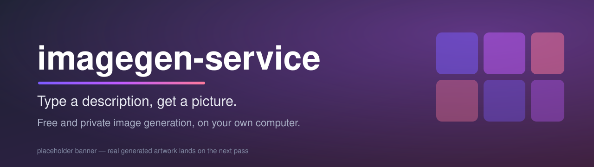
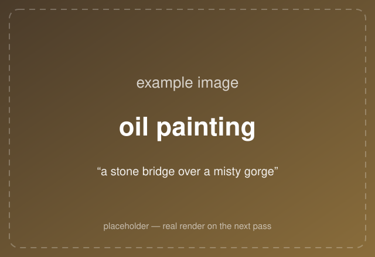
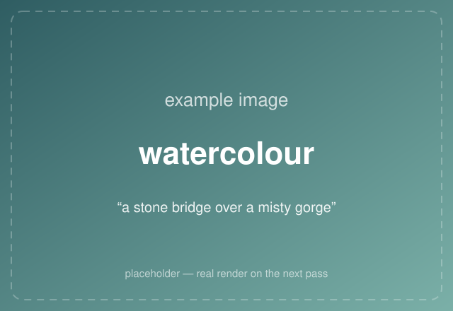
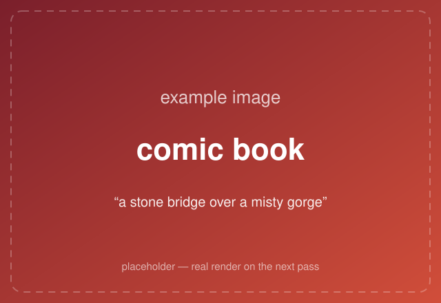
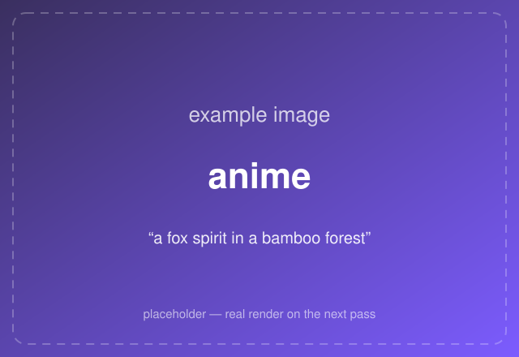
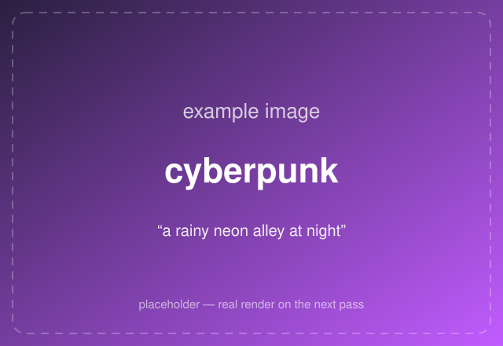
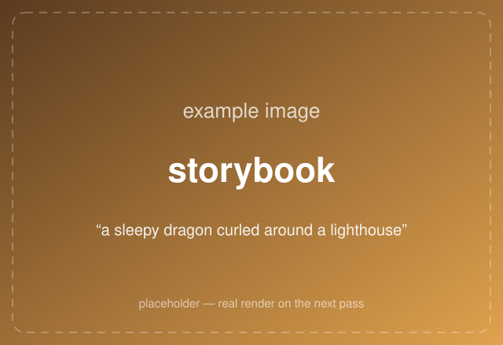

<!-- Banner: placeholder for now — see EXAMPLES-TODO.md for the real artwork planned next pass. -->


<h1 align="center">imagegen-service</h1>

<p align="center">
  <b>Type a description, get a picture.</b><br>
  A free, private image maker that runs on <i>your own computer</i> — no cloud, no subscription, no per-picture fee.
</p>

<p align="center">
  <a href="docs/README.md">📖 Start here (plain-English guide)</a> ·
  <a href="docs/install-ubuntu.md">🐧 Install on Linux</a> ·
  <a href="docs/install-windows.md">🪟 Install on Windows</a> ·
  <a href="docs/gallery.md">🖼️ Gallery</a> ·
  <a href="docs/developer-reference.md">🛠️ For developers</a>
</p>

---

## What is this?

You type words like *"a stone bridge over a misty gorge"* and it makes you an image. The whole
job happens **on your own machine, using your computer's graphics card** — nothing is sent to a
company's servers, and there's no account or fee. Once it's set up, it's yours.

One thing to know up front, because it's the part people find surprising:

> **imagegen-service isn't an app you open every day. It's a building block.**
> Think of it as the *engine* of a car, not the car. Its job is to quietly sit there and hand
> pictures to your **other** apps whenever they ask — a game that needs to illustrate a scene, a
> storytelling app that wants matching artwork, or your own little projects.

It **does** come with a simple built-in web page for trying it yourself — type a prompt, watch the
picture appear — which is perfect for a first play and for testing. See
**[Using it](docs/using-it.md)**.

## A taste of what it makes

*(Placeholder previews for now — real generated images arrive on the next pass. See
[the full gallery](docs/gallery.md).)*

| | | |
|:---:|:---:|:---:|
|  |  |  |
| **oil painting** | **watercolour** | **comic book** |
|  |  |  |
| **anime** | **cyberpunk** | **storybook** |

## What you need (the honest version)

- **A Windows or Linux computer.**
- **A supported NVIDIA graphics card.** This is the important one. Drawing an image is heavy work,
  and it's the graphics card (the "GPU") that does it. No NVIDIA card means it can't run on that
  machine. *(Not sure if you have one? Each install page shows you how to check in a click or two.)*

> **What about a Mac?** Sorry — **Macs aren't supported.** The part that actually draws the image
> needs an NVIDIA graphics card, and Macs don't have one. If your main computer is a Mac, you can
> still set this up on **another** computer that has an NVIDIA card (an old gaming PC is perfect)
> and reach it from anywhere on your home network.

## Get started in three steps

1. **Check your graphics card** — the install page for your platform starts by showing you how.
2. **Run one installer command** — it sets up everything (the drawing engine, the art models, and
   this service) and keeps it all running, even after a reboot.
3. **Open the page and make a picture.**

Pick your platform and follow that one page — each is written for someone who has never done
anything like this before:

- 🐧 **[Install on Ubuntu Linux](docs/install-ubuntu.md)** — *the well-tested path*
- 🪟 **[Install on Windows](docs/install-windows.md)** — *works, but newer (see the note on that page)*

Then head to **[Using it](docs/using-it.md)**.

## The art styles

Generate a plain, realistic picture, or pick one of **12 art styles** to give it a distinct look:

| Style | The feel | | Style | The feel |
|---|---|---|---|---|
| *(no style)* | Realistic | | storybook | Whimsical |
| pixel art | Retro | | 3d | Pixar-ish |
| oil painting | Classic | | cyberpunk | Neon |
| comic book | Bold | | ukiyo-e | Japanese |
| lego-style | Blocky | | claymation | Clay |
| pencil sketch | Hand-drawn | | anime | Animated |
| watercolour | Soft | | | |

You can also just **describe a style in your own words** (like "noir" or "ghibli") and it'll do its
best. There's even a way to feed it a **reference photo** so a character keeps the same face across
different scenes — see [Using it](docs/using-it.md#make-a-character-look-consistent).

## Part of a small family of projects

imagegen-service is one piece of a set of local-first hobby projects — small building blocks that
each do one job well, on your own hardware:

| Project | What it is | How it relates |
|---|---|---|
| **[Chronicle](https://github.com/kbennett2000/chronicle)** | A mobile-first solo Dungeons & Dragons app with an AI dungeon master. | The ancestor — imagegen-service is a clean-room extraction of Chronicle's image backend. |
| **[Scriptorium](https://github.com/kbennett2000/scriptorium)** | Turns books into illustrated, offline-readable bundles. | A live user — it calls this service to draw its illustration plates. |
| **[text-transform-service](https://github.com/kbennett2000/text-transform-service)** | Turns messy text into clean, structured results using a local AI model. | A sibling building block — it writes the image *prompts* other apps then send here. |
| **[Brickfeed](https://github.com/kbennett2000/brickfeed-news)** | A toy-brick-styled news site that rewrites and illustrates each story. | An ecosystem sibling that builds on the same local-first toolkit. |

## For developers

The API, configuration, authentication, and always-on deployment details live in the
**[Developer reference](docs/developer-reference.md)** — the HTTP contract (`POST /generate`,
`GET /styles`, `GET /health`), the JSON config file, the optional token gate, and the systemd unit.

Quick facts: TypeScript on Node, run directly with `tsx` (no build step); Node's built-in HTTP
server and `fetch` (no web framework, no runtime dependencies); file-based config only (no
environment variables). It fronts a local [ComfyUI](https://github.com/comfyanonymous/ComfyUI) and
returns raw PNG bytes.

```bash
npm install
npm start          # listens on 0.0.0.0:8189, talks to ComfyUI on :8188
npm run test:unit  # CI-safe; mocks ComfyUI, no GPU needed
```

## License

[MIT](LICENSE) © 2026 Kris Bennett.
