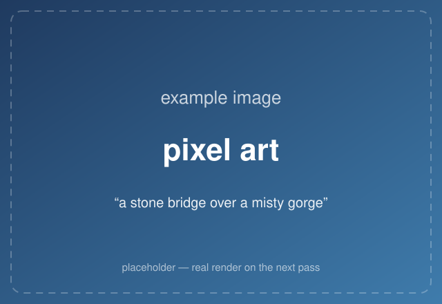
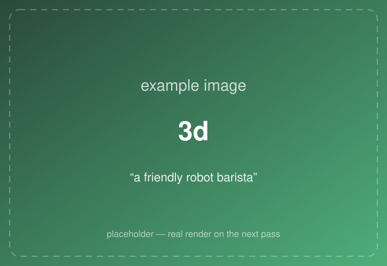
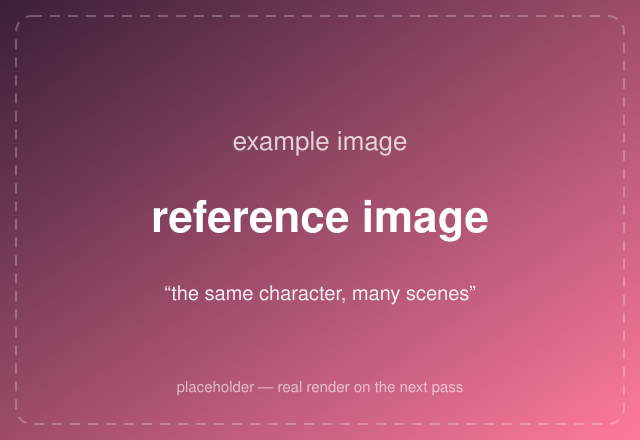

# Gallery

A taste of what imagegen-service can make. **Every image on this page is a placeholder for now** —
real generated artwork lands on the next pass (see
[EXAMPLES-TODO.md](../EXAMPLES-TODO.md) for the list being filled in).

New here? Start with the **[plain-English guide](README.md)**, or jump straight to
**[installing it](README.md#get-started)**.

## One prompt, many styles

The same words — *"a stone bridge over a misty gorge"* — rendered in different art styles. It's the
quickest way to feel how much the **Style** setting changes the mood.

| | | |
|:---:|:---:|:---:|
|  |  |  |
| **oil painting** | **watercolour** | **comic book** |
|  |  |  |
| **pixel art** | **anime** | **cyberpunk** |

## A few different ideas

Different prompts, each in a style that suits it — a reminder that you can make just about anything.

| | | |
|:---:|:---:|:---:|
|  |  |  |
| *"a friendly robot barista"* — **3d** | *"a sleepy dragon curled around a lighthouse"* — **storybook** | *the same character, many scenes* — **[reference image](using-it.md#make-a-character-look-consistent)** |

## Make your own

Every picture here started as a few plain words. Once the service is running, open the built-in test
page, type a description, pick a style, and click **Generate** — see **[Using it](using-it.md)**.

The full list of styles (and the feel each gives) is on the
**[overview page](README.md#the-art-styles)**.
