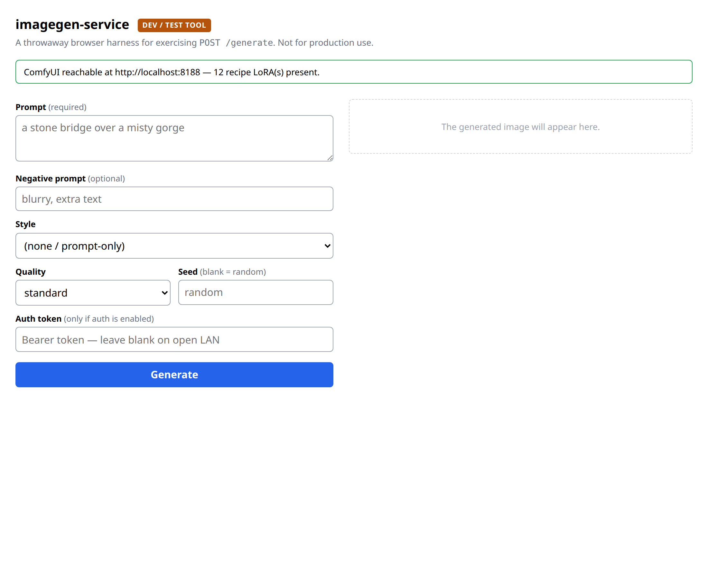
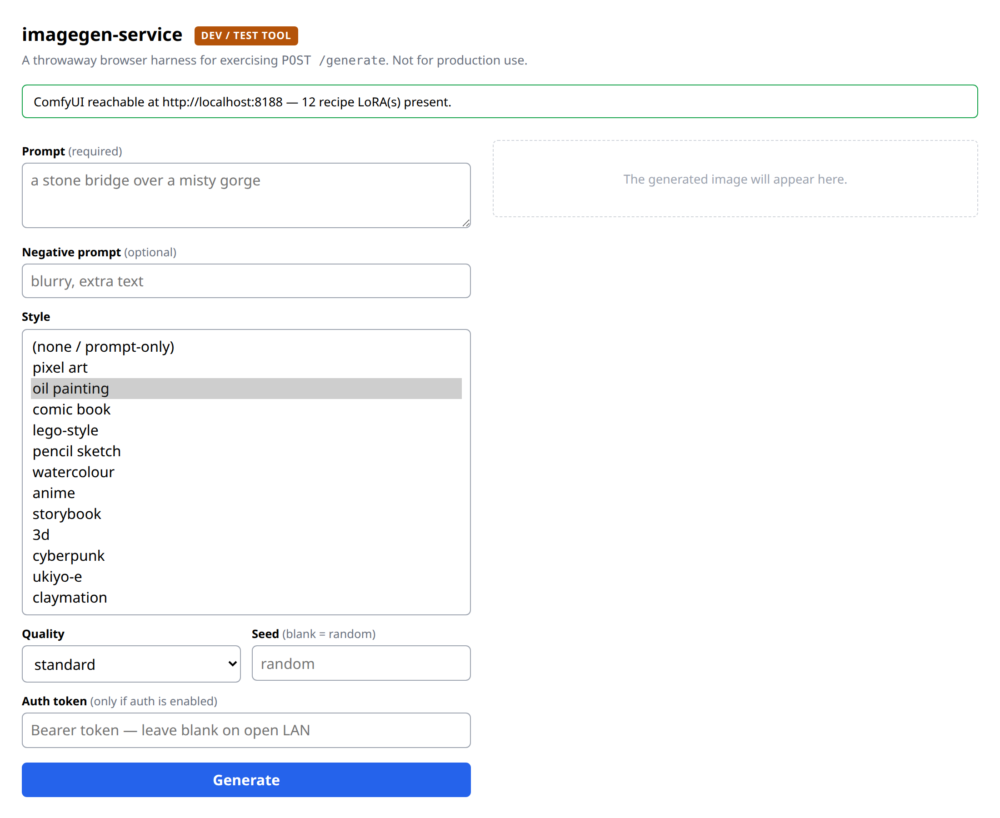
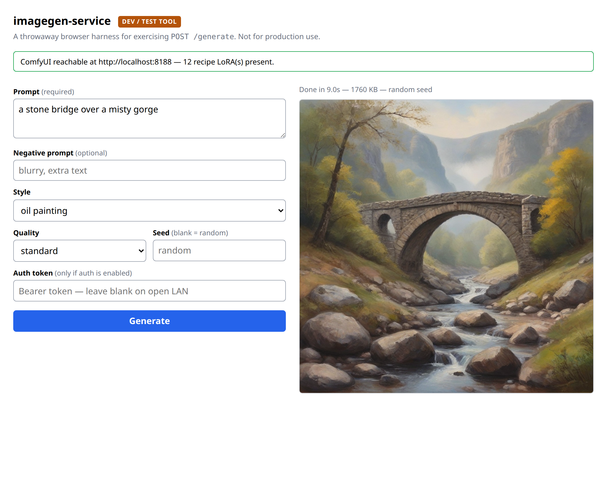

# Using it

Once imagegen-service is installed and running, there are two ways it gets used:

1. **You, directly** — through the simple built-in web page, for trying things out.
2. **Your other apps, automatically** — they ask it for pictures behind the scenes.

This page covers both, starting with the web page.

---

## The built-in test page

Open a web browser on the same computer and go to:

**http://localhost:8189**

*(From another computer on your home network, use that machine's address instead — the installer's
success message showed it, something like `http://192.168.1.50:8189`.)*

You'll see this:



Here's what each part does, in plain terms:

- **The green bar at the top** is a health check. When it's green and says "reachable", everything's
  working. If it's red, the drawing engine (ComfyUI) isn't running — give it a minute after
  starting your computer, or re-run the installer.
- **Prompt** *(required)* — describe the picture you want, in ordinary words. Be specific:
  *"a stone bridge over a misty gorge"* works better than just *"a bridge"*.
- **Negative prompt** *(optional)* — things you *don't* want to see. For example, typing `blurry`
  here nudges it away from blurry results. You can leave this empty.
- **Style** — the overall look. Leave it on *(none / prompt-only)* for a realistic picture, or pick
  one of the art styles.
- **Quality** — how much effort to put in:
  - **fast** — quickest, a bit rougher. Good for trying ideas.
  - **standard** — the balanced default. Recommended.
  - **high** — slower, a little more polished.
- **Seed** *(optional)* — leave it blank to get a fresh random picture each time. If you find one
  you love and want to reproduce or tweak it, note down the seed shown with the result and type it
  back in here.
- **Auth token** — leave this **empty**. It's only needed if someone deliberately locked the
  service with a password; a normal home setup doesn't.

### Picking a style

Click the **Style** dropdown and you'll see all the choices:



Pick whichever look you're after. The [overview page](README.md#the-art-styles) lists what each
style feels like.

### Generating a picture

Type a prompt, pick a style and quality, and click the blue **Generate** button. Give it a few
seconds — usually about **5 to 15 seconds** — and your picture appears on the right, with a note
telling you how long it took:



That's it. Change the words, try a different style, and generate again. Every random result is
different, so feel free to keep clicking Generate until you get one you like.

---

## How another app uses it (the real point)

The web page above is just for you to play with. The main job of imagegen-service is to make
pictures for **other apps** — automatically, without you doing anything.

Under the hood, an app "asks for a picture" by sending imagegen-service a short message with the
description, and getting an image back. If you're curious what that looks like, here's the entire
request — one line an app sends:

```bash
curl -X POST http://localhost:8189/generate \
  -H 'content-type: application/json' \
  -d '{"prompt":"a stone bridge over a misty gorge","style":"oil painting"}' \
  -o picture.png
```

That saves a finished `picture.png`. **You don't have to run this** — it's just to show that asking
for an image is a single, simple step. When you use an app that's wired up to imagegen-service, the
app does this for you every time it needs artwork, quietly, for free, and without sending your words
to anyone else.

*(Developers: the full request options — quality, negative prompts, seeds, the optional password,
and the other endpoints — are in the [main project README](../README.md).)*

---

## Where the pictures (and styles) come from

Everything happens on your own computer. When you ask for a picture, imagegen-service hands your
description to a local drawing engine (called **ComfyUI**) that uses a large AI model to paint the
image on your graphics card. Nothing leaves your machine.

The **art styles** are small add-on files that were downloaded during install, each teaching the
engine a particular look (oil painting, pixel art, and so on).

**One honest note:** a couple of those style files can be tricky to download automatically. If one
didn't come down during install, that's not a problem — **the style still works, it just looks a
bit plainer** (the engine falls back to doing its best from your words alone). The installer tells
you at the end if any were skipped. Everything else keeps working normally, and a maintainer can
add a working download link later so it fills in on the next install.
